### Hi, I'm Jalil

Software & AI engineer building AI-agent tooling, machine-learning systems and full-stack products. MEng in Computer Science at **Cornell Tech** (2026–2027). BSc in Statistics & Computer Science from **McGill**.

As a student consultant I worked on machine learning and data science projects with **Michelin** and **IATA**. I've also done reinforcement-learning research at **McGill** and software engineering at **Deloitte** and **IOMETE** (YC W22).

My portfolio is a 3D mechanical keyboard. **[Press a key →](https://jaliljabbarli.vercel.app)**

## Featured projects

<table>
  <tr>
    <td width="50%" valign="top">
      <h3><a href="https://github.com/Jalil-g/Immune-Harness">Immune Harness</a></h3>
      A security layer for AI agents. It checks every tool call before it runs and blocks the risky ones. When it catches a new attack, it writes or rewrites a policy to cover the variant and tests it before going live.
        
      <b>2.6×</b> faster at stopping repeat threats · <b>30/30</b> live test cases classified correctly
        
      <code>Python</code> <code>FastAPI</code> <code>MongoDB Atlas</code> <code>LLMs</code>
    </td>
    <td width="50%" valign="top">
      <h3><a href="https://github.com/alpbahadur/49-IDE">49 Agents IDE</a></h3>
      An open-source 2D IDE for running AI coding agents across terminals, git and files on many projects and machines. I designed core features, led the Hacker News and Product Hunt launches, and shipped a terminal security patch that blocked all 4 tested attack paths.
        
      <b>600+</b> GitHub stars
        
      <code>Node.js</code> <code>WebSockets</code> <code>tmux</code>
    </td>
  </tr>
  <tr>
    <td width="50%" valign="top">
      <h3><a href="https://github.com/Jalil-g/portfolio-v2">3D keyboard portfolio</a></h3>
      My portfolio as a mechanical keyboard, built from scratch. Keycaps are modelled in code, every switch sound is synthesized with Web Audio, and the board reflows from 5×3 to 3×5 on phones.
        
      <a href="https://jaliljabbarli.vercel.app"><b>jaliljabbarli.vercel.app</b></a>
        
      <code>React</code> <code>TypeScript</code> <code>three.js</code> <code>React Three Fiber</code>
    </td>
    <td width="50%" valign="top">
      <h3><a href="https://github.com/Jalil-g/Posely">Posely</a></h3>
      An AI photo-pose coach. It analyzes body posture in real time and suggests better poses, using a CNN trained on a 10K+ image dataset I collected and cleaned.
        
      <code>Python</code> <code>PyTorch</code> <code>OpenCV</code> <code>MediaPipe</code> <code>FastAPI</code>
    </td>
  </tr>
</table>

**More:**
[Dinner With a Stranger](https://github.com/Jalil-g/dinner-with-a-stranger) (student dinner matching, 400+ users) ·
[reforge](https://github.com/Jalil-g/reforge) (turns past Claude Code / Codex sessions into rebuildable specs) ·
[Qarabağ vs Athletic Club predictor](https://github.com/Jalil-g/match-prediction-champions-league-qarabag-vs-bilbao) ·
[DNA evolution simulator](https://github.com/Jalil-g/evolution-simulation)

## Tech

## Say hi

Speaks English, French, Azerbaijani, Turkish and Russian. Banner rendered from the portfolio's 3D keyboard; artwork generated by <a href="scripts/build.mjs"><code>scripts/build.mjs</code></a>.
